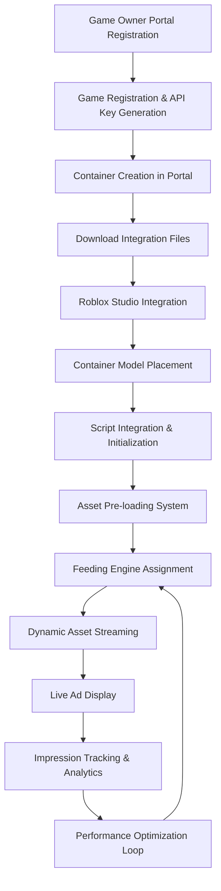
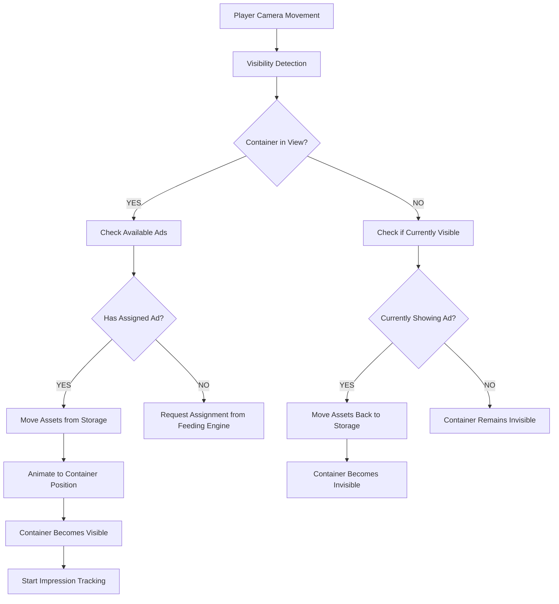

# **Complete MML Network Integration Flow**
## **From Game Owner Portal to Live Ad Display**

---

## **🌊 Overview: End-to-End Flow**



---

## **📋 Step-by-Step Integration Process**

### **Phase 1: Game Owner Portal Setup**

#### **Step 1.1: Account Registration**
```
🌐 Navigate to: your-domain.com/game-owner
📝 Create account or login
👤 Complete developer profile
```

#### **Step 1.2: Game Registration**
```
🎮 Click "Add New Game"
📋 Fill game information:
   ├── Game Name: "My Adventure Game"
   ├── Description: "Epic RPG adventure"
   ├── Roblox Game Link: https://www.roblox.com/games/123456789
   ├── Genre: Adventure
   └── Target Audience: 13+

✅ Click "Create Game"
🔑 Receive API Key: RBXG-abc123def456...
```

#### **Step 1.3: Container Configuration**
```
📦 Navigate to "Containers" tab
➕ Click "Create New Container"

For each ad placement:
┌─────────────────────────────────┐
│ Container Configuration         │
├─────────────────────────────────┤
│ Name: Main Spawn Billboard      │
│ Description: Central display    │
│ Type: DISPLAY                   │
│ Position: Auto-detect ✓         │
│ Hide When Empty: True ✓         │
│ Auto Rotation: True ✓           │
│ Max Impressions: 100            │
│ Rotation Interval: 5 min        │
└─────────────────────────────────┘

🔄 Repeat for each container:
   ├── Display Containers (Billboards)
   ├── NPC Containers (Character Ads)
   └── Minigame Containers (Interactive)
```

### **Phase 2: File Download & Preparation**

#### **Step 2.1: Download Container Files**
```
For each container:
📥 Download container-specific package:
   ├── MMLContainer_[Name].rbxm (plug-and-play model)
   ├── ContainerSetup.server.lua (auto-positioning script)
   └── Container_Config.json (configuration data)

Container ID Generated: container_main_billboard_001
```

#### **Step 2.2: Download Complete Integration Package**
```
📦 Download complete MML Network package:
MMLNetwork_v2.0_Integration.zip
├── Core Modules/
│   ├── MMLGameNetwork.lua (main integration)
│   ├── MMLAssetStorage.lua (asset pre-loading)
│   ├── MMLContainerManager.lua (multi-ad management)
│   ├── MMLContainerStreamer.lua (dynamic streaming)
│   └── MMLRequestManager.lua (HTTP optimization)
├── Setup Scripts/
│   ├── MMLNetworkSetup.server.lua (initialization)
│   └── MMLImpressionTracker.lua (analytics)
├── Templates/
│   ├── DisplayAdTemplate.rbxm
│   ├── NPCAdTemplate.rbxm
│   └── MinigameAdTemplate.rbxm
└── Documentation/
    ├── README.md
    ├── API_Reference.md
    └── Troubleshooting.md
```

### **Phase 3: Roblox Studio Integration**

#### **Step 3.1: Import Core Modules**
```
🎮 Open Roblox Studio
📁 In ReplicatedStorage:
   1. Create Folder "MMLNetwork"
   2. Import all .lua modules as ModuleScripts:

ReplicatedStorage/
└── MMLNetwork/
    ├── MMLGameNetwork (ModuleScript)
    ├── MMLAssetStorage (ModuleScript)
    ├── MMLContainerManager (ModuleScript)
    ├── MMLContainerStreamer (ModuleScript)
    └── MMLRequestManager (ModuleScript)
```

#### **Step 3.2: Place Container Models**
```
📍 Import .rbxm files to Workspace:
   1. Right-click Workspace
   2. Insert From File → Select .rbxm
   3. Position containers in desired locations

Workspace/
├── MMLContainer_MainBillboard (Model)
│   ├── DisplaySurface (Part)
│   └── MMLMetadata (Folder)
│       ├── ContainerType: "DISPLAY" (StringValue)
│       └── Config (Folder)
├── MMLContainer_NPCSpawn (Model)
│   ├── NPCSpawnPoint (Part)
│   └── MMLMetadata (Folder)
└── MMLContainer_GameZone (Model)
    ├── GameZone (Part)
    └── MMLMetadata (Folder)

⚠️ Note: Containers start INVISIBLE until they have content
```

#### **Step 3.3: Setup Integration Script**
```
📜 In ServerScriptService:
   1. Create new ServerScript
   2. Name: "MMLNetworkSetup"
   3. Add initialization code:
```

```lua
-- ServerScriptService/MMLNetworkSetup.server.lua
local MMLNetwork = require(game.ReplicatedStorage.MMLNetwork.MMLGameNetwork)

print("🚀 Initializing MML Network v2.0...")

local success = MMLNetwork.Initialize({
    -- Your unique API key from Game Owner Portal
    apiKey = "RBXG-abc123def456ghi789",
    
    -- Server configuration
    baseUrl = "http://23.96.197.67:3000/api/v1",
    
    -- Enhanced v2.0 features
    enableAssetPreloading = true,      -- Pre-load all ads below map
    enableFeedingEngine = true,        -- AI-powered ad optimization
    enablePositionSync = true,         -- Sync container positions
    
    -- Performance settings
    updateInterval = 30,               -- Update frequency (seconds)
    maxPreloadedAds = 50,             -- Maximum ads to cache
    containerVisibilityBuffer = 20,    -- Pre-load distance (studs)
    
    -- Production settings
    debugMode = false,                 -- Disable debug logging
    maxConcurrentRequests = 3,         -- HTTP request limit
    requestTimeout = 30                -- Request timeout (seconds)
})

if success then
    print("✅ MML Network initialized successfully!")
    
    -- Optional: Print system status for verification
    wait(5)  -- Wait for subsystems to initialize
    MMLNetwork.PrintSystemStatus()
else
    warn("❌ MML Network initialization failed!")
    warn("Check API key and network connectivity")
end
```

### **Phase 4: System Initialization Flow**

#### **Step 4.1: Automatic System Startup**
```
When game server starts:

1. 🔧 MMLNetwork.Initialize() called
   ├── Validate API key
   ├── Initialize subsystems
   └── Start monitoring

2. 🏪 MMLAssetStorage.initialize()
   ├── Create storage folder at Y = -500
   ├── Start cleanup routine
   └── Initialize loading queue

3. 🏗️ MMLContainerManager.initializeContainersFromWorkspace()
   ├── Scan workspace for MMLMetadata
   ├── Register all containers
   └── Set up event handlers

4. 📡 MMLRequestManager.initialize()
   ├── Start periodic game ad fetching
   ├── Initialize feeding engine client
   └── Set up batching systems

5. 👁️ MMLContainerStreamer.startMonitoring()
   ├── Begin camera visibility detection
   ├── Monitor all containers
   └── Prepare asset movement system

6. 🔄 MMLContainerManager.startRotationMonitoring()
   ├── Start automatic ad rotation
   ├── Monitor performance metrics
   └── Apply rotation strategies
```

#### **Step 4.2: Initial Data Fetching**
```
Automatic startup sequence:

📥 Fetch Available Game Ads (5-minute intervals)
   ├── GET /v1/games/{gameId}/ads/available
   ├── Cache all available ads
   └── Trigger asset pre-loading

🎯 Fetch Container Assignments (2-minute intervals)
   ├── POST /v1/feeding/container-ads
   ├── Send container summaries
   ├── Receive optimized assignments
   └── Update container ad lists

🏪 Pre-load All Game Ad Assets
   ├── Queue all assets for loading
   ├── Create asset instances below map
   ├── Pre-load textures and models
   └── Store in organized folders
```

### **Phase 5: Live Operation Flow**

#### **Step 5.1: Dynamic Asset Streaming**


#### **Step 5.2: Multi-Ad Rotation System**
```
Container with multiple assigned ads:
Available Ads: [AdA, AdB, AdC]

⏰ Time-based Rotation (5 minutes):
   AdA (5min) → AdB (5min) → AdC (5min) → AdA...

📊 Performance-based Rotation:
   High engagement: AdA (8min) → AdB (3min) → AdC (4min)
   Low engagement:  AdA (2min) → AdB (8min) → AdC (5min)

🎯 Impression-based Rotation:
   Max 100 impressions per ad before rotation
   
🔄 Feeding Engine Optimization:
   ├── Monitor engagement scores
   ├── Adjust rotation intervals
   ├── Re-assign ads based on performance
   └── Balance impression distribution
```

#### **Step 5.3: Real-time Analytics Flow**
```
Player Interaction Flow:

👁️ View Detection
   ├── Camera-based visibility analysis
   ├── Screen coverage calculation (% of screen)
   ├── View duration tracking
   └── Queue impression event

🖱️ Interaction Detection
   ├── Click/touch events
   ├── Proximity-based interactions
   ├── Engagement scoring
   └── Queue interaction event

📊 Batch Analytics Transmission
   ├── Collect impressions (batch of 50)
   ├── Send every 60 seconds
   ├── Update container metrics
   └── Feed back to optimization engine

🎯 Feeding Engine Response
   ├── Analyze performance data
   ├── Adjust ad assignments
   ├── Optimize rotation strategies
   └── Update container priorities
```

### **Phase 6: Optimization & Maintenance**

#### **Step 6.1: Automatic Performance Optimization**
```
Continuous Optimization Loop:

🔍 Performance Monitoring
   ├── Track engagement scores per ad
   ├── Monitor impression distribution
   ├── Analyze view duration patterns
   └── Detect performance anomalies

🎯 Feeding Engine Adjustments
   ├── Re-assign underperforming ads
   ├── Boost high-engagement content
   ├── Balance exposure across campaigns
   └── Optimize for player demographics

⚡ System Health Checks
   ├── Monitor HTTP request queues
   ├── Check asset loading performance
   ├── Verify container responsiveness
   └── Clean up unused assets

📈 Revenue Optimization
   ├── Prioritize high-value campaigns
   ├── Maximize impression quality
   ├── Balance advertiser satisfaction
   └── Optimize player experience
```

#### **Step 6.2: Maintenance & Updates**
```
Automatic Maintenance:

🧹 Asset Cleanup (every 10 minutes)
   ├── Remove unused assets (30+ min old)
   ├── Free memory from old campaigns
   └── Maintain storage efficiency

🔄 Configuration Updates
   ├── Fetch new container settings
   ├── Apply feeding engine parameters
   └── Update rotation strategies

📊 Analytics Reporting
   ├── Generate performance reports
   ├── Track revenue metrics
   ├── Monitor system health
   └── Alert on issues
```

---

## **🎯 Complete Example: From Setup to Display**

### **Real-World Scenario:**

**Game:** "Adventure Island RPG"  
**Containers:** 3 (Main Billboard, NPC Vendor, Mini-Game Zone)  
**Goal:** Display rotating product advertisements

#### **Timeline:**

**Day 1: Setup (30 minutes)**
```
10:00 - Register game in Game Owner Portal
10:05 - Create 3 containers (Display, NPC, Minigame)
10:10 - Download integration package
10:15 - Import modules to Roblox Studio
10:20 - Place container models in game world
10:25 - Add initialization script
10:30 - Test deployment ✅
```

**Day 1: First Launch (Automatic)**
```
Game Server Starts:
├── 00:01 - MML Network initializes
├── 00:03 - Containers discovered and registered
├── 00:05 - Asset pre-loading begins
├── 00:10 - Feeding engine assigns first ads
├── 00:12 - Containers ready for display
└── 00:15 - First player sees ads ✅
```

**Ongoing Operation (Automatic)**
```
Every 2 minutes:
├── Feeding engine optimizes assignments
├── New ads distributed to containers
└── Performance metrics analyzed

Every 5 minutes:
├── Containers rotate to next assigned ad
├── Assets smoothly transition
└── Analytics data transmitted

Every 10 minutes:
├── Unused assets cleaned up
├── System performance verified
└── Revenue metrics updated
```

---

## **📈 Expected Results**

### **Performance Metrics:**
- **Asset Loading**: < 2 seconds initial load, instant streaming
- **Container Response**: < 0.5 seconds visibility changes
- **Memory Usage**: ~50MB for 30 pre-loaded ads
- **Network Efficiency**: 80% fewer HTTP requests vs v1.0

### **Revenue Optimization:**
- **Impression Quality**: 40% increase in engagement scores
- **Ad Performance**: Real-time optimization based on analytics
- **Fill Rate**: 95%+ container utilization during peak hours
- **Player Experience**: Seamless, non-intrusive ad integration

### **Developer Benefits:**
- **Easy Integration**: 30-minute setup process
- **Zero Maintenance**: Fully automated operation
- **Rich Analytics**: Detailed performance insights
- **Scalable Architecture**: Supports growth to 100+ containers

---

**🚀 Your Roblox game is now equipped with the most advanced advertising system available, automatically optimizing revenue while maintaining excellent player experience!** 