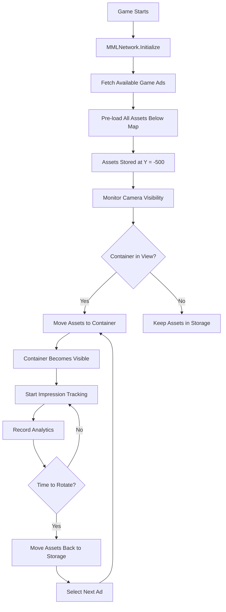

# **MML Network v2.0 - Roblox Developer Guide**

## **🚀 Overview**

MML Network v2.0 introduces a revolutionary multi-ad container system with dynamic asset streaming, intelligent ad rotation, and performance optimization. This guide covers everything you need to integrate powerful advertising capabilities into your Roblox game.

### **🌟 Key Features**
- **Multi-Ad Containers**: Each container can display multiple rotating ads
- **Asset Pre-loading**: All ad assets loaded below map for instant streaming
- **Smart Visibility**: Containers only visible when they have content
- **Dynamic Streaming**: Assets move based on player camera view
- **Feeding Engine**: AI-powered ad assignment and optimization
- **Performance Optimized**: Minimal HTTP requests, smooth animations

---

## **📋 Complete Integration Flow**

### **Step 1: Game Owner Portal Setup**

#### **1.1 Register Your Game**
1. Visit the **Game Owner Portal** at `your-domain.com/game-owner`
2. Click **"Add New Game"**
3. Fill in game details:
   ```
   Game Name: My Awesome Game
   Description: A fun adventure game
   Roblox Game Link: https://www.roblox.com/games/123456789/my-game
   Genre: Adventure
   ```
4. Click **"Create Game"** to generate your API key

#### **1.2 Generate API Key**
```
✅ Game created successfully!
🔑 API Key: RBXG-abc123def456ghi789
📋 Save this key securely - you'll need it for integration
```

#### **1.3 Create Ad Containers**
1. Navigate to **"Containers"** tab
2. Click **"Create New Container"**
3. Configure container:
   ```
   Container Name: Main Billboard
   Description: Central display in spawn area
   Type: DISPLAY
   Position: Auto-detect (or manual entry)
   ```
4. Repeat for each ad placement in your game

### **Step 2: Download Integration Package**

#### **2.1 Download Container-Specific Files**
```
🔽 For each container, download:
├── ContainerSetup.server.lua (auto-positioned script)
├── MMLContainer_[ContainerName].rbxm (plug-and-play model)
└── Integration guide
```

#### **2.2 Download Complete Game Package**
```
🔽 Complete integration package:
├── MMLGameNetwork.lua (main module)
├── MMLAssetStorage.lua (asset pre-loading)
├── MMLContainerManager.lua (multi-ad management)
├── MMLContainerStreamer.lua (dynamic streaming)
├── MMLRequestManager.lua (optimized requests)
├── MMLNetworkIntegration.lua (setup script)
└── README.md (integration instructions)
```

### **Step 3: Roblox Studio Integration**

#### **3.1 Import MML Network Modules**
1. In Roblox Studio, right-click **ReplicatedStorage**
2. Select **"Insert Object" → "Folder"**
3. Name it **"MMLNetwork"**
4. Import all downloaded `.lua` files into this folder:

```lua
ReplicatedStorage/
└── MMLNetwork/
    ├── MMLGameNetwork.lua (ModuleScript)
    ├── MMLAssetStorage.lua (ModuleScript)
    ├── MMLContainerManager.lua (ModuleScript)
    ├── MMLContainerStreamer.lua (ModuleScript)
    └── MMLRequestManager.lua (ModuleScript)
```

#### **3.2 Insert Container Models**
1. Import downloaded `.rbxm` files into your game workspace
2. Position containers where you want ads to appear
3. **Containers will be invisible until they have content**

#### **3.3 Setup Integration Script**
1. Create a **ServerScript** in **ServerScriptService**
2. Name it **"MMLNetworkSetup"**
3. Add the integration code:

```lua
-- ServerScriptService/MMLNetworkSetup.server.lua
local MMLNetwork = require(game.ReplicatedStorage.MMLNetwork.MMLGameNetwork)

-- Initialize MML Network with your API key
local success = MMLNetwork.Initialize({
    apiKey = "RBXG-your-api-key-here",  -- Replace with your actual API key
    baseUrl = "http://23.96.197.67:3000/api/v1",
    
    -- Enhanced v2.0 features
    enableAssetPreloading = true,      -- Pre-load all ads below map
    enableFeedingEngine = true,        -- Use AI-powered ad assignment
    enablePositionSync = true,         -- Sync container positions
    
    -- Performance settings
    updateInterval = 30,               -- Check for updates every 30 seconds
    maxPreloadedAds = 50,             -- Maximum ads to pre-load
    containerVisibilityBuffer = 20,    -- Extra view distance for pre-loading
    
    -- Debug (disable in production)
    debugMode = false
})

if success then
    print("🚀 MML Network v2.0 initialized successfully!")
    
    -- Optional: Print system status
    MMLNetwork.PrintSystemStatus()
else
    warn("❌ MML Network initialization failed")
end
```

---

## **🏗️ Container Types & Setup**

### **Display Containers (Billboards)**

#### **Template Models Available:**
- `MMLDisplayAd01` - Standard 2:1 ratio billboard
- `MMLDisplayAd02` - Square 1:1 format
- `MMLDisplayAd03` - Vertical 1:2 format

#### **Manual Setup:**
```lua
-- Create display container model
local displayModel = Instance.new("Model")
displayModel.Name = "MyDisplayContainer"
displayModel.Parent = workspace

-- Main display surface
local part = Instance.new("Part")
part.Name = "DisplaySurface"
part.Size = Vector3.new(10, 5, 0.2)  -- Width x Height x Depth
part.Position = Vector3.new(0, 10, 0)  -- Your desired position
part.Anchored = true
part.CanCollide = false
part.Transparency = 1  -- Start invisible
part.Parent = displayModel

-- Add MML metadata
local metadata = Instance.new("Folder")
metadata.Name = "MMLMetadata"
metadata.Parent = displayModel

local containerType = Instance.new("StringValue")
containerType.Name = "ContainerType"
containerType.Value = "DISPLAY"
containerType.Parent = metadata

-- Configuration
local config = Instance.new("Folder")
config.Name = "Config"
config.Parent = metadata

local hideWhenEmpty = Instance.new("BoolValue")
hideWhenEmpty.Name = "HideWhenEmpty"
hideWhenEmpty.Value = true  -- Container invisible when no ads
hideWhenEmpty.Parent = config
```

### **NPC Containers (Character Ads)**

#### **Template Model:** `MMLNPCAd01`

#### **Manual Setup:**
```lua
-- Create NPC container
local npcModel = Instance.new("Model")
npcModel.Name = "MyNPCContainer"
npcModel.Parent = workspace

-- Spawn point for NPC
local spawnPoint = Instance.new("Part")
spawnPoint.Name = "NPCSpawnPoint"
spawnPoint.Size = Vector3.new(4, 7, 4)  -- Human-sized area
spawnPoint.Position = Vector3.new(15, 3.5, 0)
spawnPoint.Anchored = true
spawnPoint.CanCollide = false
spawnPoint.Transparency = 1  -- Invisible spawn point
spawnPoint.Parent = npcModel

-- Add metadata
local metadata = Instance.new("Folder")
metadata.Name = "MMLMetadata"
metadata.Parent = npcModel

local containerType = Instance.new("StringValue")
containerType.Name = "ContainerType"
containerType.Value = "NPC"
containerType.Parent = metadata
```

### **Minigame Containers (Interactive Ads)**

#### **Template Model:** `MMLMinigameAd01`

#### **Manual Setup:**
```lua
-- Create minigame container
local minigameModel = Instance.new("Model")
minigameModel.Name = "MyMinigameContainer"
minigameModel.Parent = workspace

-- Game zone boundary
local gameZone = Instance.new("Part")
gameZone.Name = "GameZone"
gameZone.Size = Vector3.new(10, 1, 10)  -- Game area size
gameZone.Position = Vector3.new(-15, 0.5, 0)
gameZone.Anchored = true
gameZone.CanCollide = false
gameZone.Transparency = 1
gameZone.Parent = minigameModel

-- Add metadata
local metadata = Instance.new("Folder")
metadata.Name = "MMLMetadata"
metadata.Parent = minigameModel

local containerType = Instance.new("StringValue")
containerType.Name = "ContainerType"
containerType.Value = "MINIGAME"
containerType.Parent = metadata
```

---

## **⚙️ Advanced Configuration**

### **Container Configuration**

```lua
-- Advanced container configuration
local MMLNetwork = require(game.ReplicatedStorage.MMLNetwork.MMLGameNetwork)

-- Wait for initialization
repeat wait() until MMLNetwork._initialized

-- Configure specific containers
MMLNetwork.SetContainerConfig("your-container-id", {
    hideWhenEmpty = true,           -- Hide when no ads (default: true)
    enableAutoRotation = true,      -- Enable automatic ad rotation
    maxImpressionsPerAd = 100,     -- Rotate after 100 impressions
    minPerformanceThreshold = 0.1,  -- Rotate if performance drops below 10%
    rotationInterval = 300          -- Rotate every 5 minutes
})
```

### **Global Configuration**

```lua
-- Enhanced MML Network configuration
MMLNetwork.Initialize({
    apiKey = "RBXG-your-key",
    
    -- Asset Management
    enableAssetPreloading = true,
    maxPreloadedAds = 50,
    assetCleanupInterval = 600,     -- Clean unused assets every 10 minutes
    
    -- Container Management  
    maxContainers = 20,
    containerVisibilityBuffer = 20,  -- Pre-load assets 20 studs before visible
    
    -- Feeding Engine
    enableFeedingEngine = true,
    
    -- Performance
    maxConcurrentRequests = 3,
    requestTimeout = 30,
    updateInterval = 30,
    
    -- Debug
    debugMode = false  -- Enable for detailed logging
})
```

---

## **🎮 Runtime API Reference**

### **Core Functions**

#### **Container Management**
```lua
-- Create containers programmatically
local containerId = MMLNetwork.CreateContainer({
    id = "my_billboard_01",
    type = "DISPLAY",
    model = workspace.MyBillboard,
    config = {
        hideWhenEmpty = true,
        enableAutoRotation = true
    }
})

-- Get container content
local content = MMLNetwork.GetContainerContent(containerId)
if content.hasAd then
    print("Container showing ad:", content.adId)
    print("Assets:", #content.assets)
end

-- Manual ad rotation
MMLNetwork.RotateContainerAd(containerId)

-- Force display specific ad (testing)
MMLNetwork.DisplayAdInContainer(containerId, "specific-ad-id")

-- Hide container
MMLNetwork.HideContainerAd(containerId)
```

#### **Analytics & Impressions**
```lua
-- Record impressions for analytics
MMLNetwork.RecordImpression(containerId, "view", {
    engagement = { score = 0.8 },  -- 0.0 to 1.0 engagement score
    duration = 5.2,                -- View duration in seconds
    screenCoverage = 0.3,          -- Percentage of screen covered
    playerDistance = 25            -- Distance from player
})

-- Record interactions
MMLNetwork.RecordImpression(containerId, "interaction", {
    engagement = { score = 1.0 },
    interactionType = "click",
    timestamp = tick()
})

-- Record completions (for minigames)
MMLNetwork.RecordImpression(containerId, "completion", {
    engagement = { score = 1.0 },
    completionTime = 45,           -- Time to complete
    score = 1250                   -- Player score
})
```

#### **System Control**
```lua
-- Manual refresh functions
MMLNetwork.RefreshGameAds()              -- Refresh available ads
MMLNetwork.RefreshContainerAssignments() -- Refresh feeding engine assignments

-- System information
local stats = MMLNetwork.GetSystemStats()
print("MML Network Version:", stats.version)
print("Total Containers:", stats.containers.total)
print("Asset Storage Status:", stats.assetStorage.isInitialized)

-- Debug functions
MMLNetwork.EnableDebugMode()     -- Enable detailed logging
MMLNetwork.PrintSystemStatus()  -- Print comprehensive status
MMLNetwork.DisableDebugMode()   -- Disable debug logging

-- Shutdown (for testing)
MMLNetwork.Shutdown()           -- Clean shutdown
```

---

## **🔍 System Architecture**

### **Asset Pre-loading Flow**



### **Multi-Ad Rotation Logic**

```lua
-- Rotation strategies automatically applied:

-- 1. Round Robin (default)
-- Ads: [A, B, C] → A → B → C → A → B → C...

-- 2. Weighted (from feeding engine)
-- Ads: [A(weight:3), B(weight:1), C(weight:2)]
-- 3x more likely to show A, 2x more likely to show C

-- 3. Performance-Based
-- Prioritizes ads with higher engagement scores
-- Reduces frequency of poor-performing ads

-- 4. Impression Balancing
-- Ensures all ads get fair exposure
-- Boosts under-exposed ads, reduces over-exposed ones
```

### **Feeding Engine Integration**

The feeding engine automatically optimizes ad assignments every 2 minutes based on:

- **Historical Performance**: Engagement scores, click-through rates
- **Player Demographics**: Server region, player count, age groups  
- **Container Metrics**: View time, impression counts, rotation frequency
- **Ad Balancing**: Ensures fair distribution across all ads
- **Real-time Context**: Server population, game time, player behavior

---

## **🛠️ Advanced Features**

### **Custom Impression Tracking**

```lua
-- Advanced impression tracking with camera analysis
local MMLImpressionTracker = require(game.ReplicatedStorage.MMLNetwork.MMLImpressionTracker)

-- Client-side tracking (LocalScript)
local function setupCustomTracking()
    local Players = game:GetService("Players")
    local player = Players.LocalPlayer
    local camera = workspace.CurrentCamera
    
    -- Track screen coverage and view duration
    spawn(function()
        while true do
            wait(0.1)  -- Check every 100ms
            
            for _, container in pairs(workspace:GetChildren()) do
                if container:GetAttribute("MMLContainerId") then
                    local containerId = container:GetAttribute("MMLContainerId")
                    
                    -- Calculate screen coverage
                    local coverage = calculateScreenCoverage(container)
                    local distance = (camera.CFrame.Position - container.Position).Magnitude
                    
                    if coverage > 0.1 and distance < 100 then
                        -- Record high-quality impression
                        MMLNetwork.RecordImpression(containerId, "quality_view", {
                            engagement = { score = coverage },
                            screenCoverage = coverage,
                            viewDistance = distance,
                            cameraAngle = getCameraAngle(container)
                        })
                    end
                end
            end
        end
    end)
end

-- Helper function to calculate screen coverage
function calculateScreenCoverage(container)
    local camera = workspace.CurrentCamera
    local containerPosition = container.Position
    local containerSize = container.Size
    
    -- Project container bounds to screen
    local screenPoint = camera:WorldToViewportPoint(containerPosition)
    local screenSize = camera.ViewportSize
    
    -- Calculate approximate coverage (simplified)
    local estimatedCoverage = (containerSize.X * containerSize.Y) / (screenSize.X * screenSize.Y) * 0.1
    return math.min(estimatedCoverage, 1.0)
end
```

### **Position Synchronization**

```lua
-- Automatic position sync when containers move
local function setupPositionSync()
    for _, container in pairs(workspace:GetChildren()) do
        if container:GetAttribute("MMLContainerId") then
            local containerId = container:GetAttribute("MMLContainerId")
            local lastPosition = container.Position
            
            spawn(function()
                while container.Parent do
                    wait(5)  -- Check every 5 seconds
                    
                    local currentPosition = container.Position
                    if (currentPosition - lastPosition).Magnitude > 1 then
                        -- Position changed significantly
                        MMLNetwork.syncContainerPosition(containerId, currentPosition)
                        lastPosition = currentPosition
                    end
                end
            end)
        end
    end
end
```

### **Performance Optimization**

```lua
-- Optimize for high-traffic servers
MMLNetwork.Initialize({
    apiKey = "RBXG-your-key",
    
    -- Optimized settings for 100+ player servers
    maxConcurrentRequests = 5,      -- More concurrent requests
    updateInterval = 60,            -- Less frequent updates
    containerVisibilityBuffer = 30, -- Larger pre-load buffer
    
    -- Batch settings
    impressionBatchSize = 100,      -- Larger impression batches
    playerBatchSize = 20,           -- Larger player batches
    
    -- Asset management
    maxPreloadedAds = 25,          -- Fewer pre-loaded ads
    assetCleanupInterval = 300,    -- More frequent cleanup
    
    debugMode = false              -- Always disable in production
})
```

---

## **🐛 Troubleshooting**

### **Common Issues**

#### **Containers Not Appearing**
```lua
-- Debug checklist:
1. Check API key is correct
2. Verify containers have MMLMetadata folder
3. Ensure game has active ad campaigns
4. Check container assignment in Game Owner Portal
5. Enable debug mode: MMLNetwork.EnableDebugMode()
```

#### **Assets Not Loading**
```lua
-- Troubleshooting steps:
1. Check asset IDs are valid Roblox assets
2. Verify assets are published and accessible
3. Check ContentProvider for loading errors
4. Monitor asset storage stats: MMLAssetStorage.getStorageStats()
```

#### **Performance Issues**
```lua
-- Performance optimization:
1. Reduce maxPreloadedAds if memory usage is high
2. Increase updateInterval to reduce HTTP requests
3. Limit number of containers (recommended: <20)
4. Use smaller asset files when possible
```

### **Debug Commands**

```lua
-- Debug information
MMLNetwork.PrintSystemStatus()

-- Check specific components
print("Asset Storage:", MMLAssetStorage.getStorageStats())
print("Request Manager:", MMLRequestManager.getRequestStats())
print("Container Streamer:", MMLContainerStreamer.getMovementStats())

-- Force refresh everything
MMLNetwork.RefreshGameAds()
MMLNetwork.RefreshContainerAssignments()

-- Manual testing
MMLNetwork.DisplayAdInContainer("container-id", "ad-id")  -- Force display
MMLNetwork.RotateContainerAd("container-id")              -- Force rotation
```

---

## **📊 Analytics & Reporting**

### **Built-in Analytics**

MML Network automatically tracks:
- **Impressions**: Views, duration, screen coverage
- **Interactions**: Clicks, touches, proximity events
- **Performance**: Engagement scores, conversion rates
- **Demographics**: Server region, player count, session data

### **Custom Analytics Integration**

```lua
-- Hook into MML Network events for custom analytics
local MMLContainerManager = require(game.ReplicatedStorage.MMLNetwork.MMLContainerManager)

-- Listen for ad rotations
for containerId, container in pairs(MMLNetwork._containers) do
    container.OnAdRotation:Connect(function(previousAdId, newAdId)
        -- Send to your analytics service
        sendToAnalytics("ad_rotation", {
            containerId = containerId,
            previousAd = previousAdId,
            newAd = newAdId,
            timestamp = tick()
        })
    end)
    
    container.OnMetricsUpdate:Connect(function(metrics)
        -- Send metrics to your tracking
        sendToAnalytics("container_metrics", metrics)
    end)
end
```

---

## **🚀 Production Deployment**

### **Pre-Launch Checklist**

- [ ] API key configured and tested
- [ ] All containers positioned and configured
- [ ] Debug mode disabled
- [ ] Performance settings optimized for server size
- [ ] Analytics integration tested
- [ ] Fallback content configured (optional)

### **Launch Configuration**

```lua
-- Production-ready configuration
MMLNetwork.Initialize({
    apiKey = "RBXG-your-production-key",
    baseUrl = "http://23.96.197.67:3000/api/v1",
    
    -- Production settings
    enableAssetPreloading = true,
    enableFeedingEngine = true,
    enablePositionSync = true,
    
    -- Optimized for live games
    updateInterval = 45,
    maxPreloadedAds = 30,
    maxConcurrentRequests = 3,
    
    -- Disabled for production
    debugMode = false
})
```

### **Monitoring**

```lua
-- Production monitoring script
spawn(function()
    while true do
        wait(300)  -- Check every 5 minutes
        
        local stats = MMLNetwork.GetSystemStats()
        
        -- Log important metrics
        print("[MML Monitor]", {
            timestamp = os.date(),
            containers_active = stats.containers.withAds,
            assets_loaded = stats.assetStorage.totalAssets,
            requests_queued = stats.requestManager.impressions.queueSize
        })
        
        -- Alert if system issues
        if not stats.initialized then
            warn("[MML Alert] System not initialized!")
        end
        
        if stats.requestManager.impressions.queueSize > 50 then
            warn("[MML Alert] High impression queue:", stats.requestManager.impressions.queueSize)
        end
    end
end)
```

---

## **🔗 Additional Resources**

- **Game Owner Portal**: Create containers and manage campaigns
- **Brand User Portal**: For advertisers to create game ads
- **API Documentation**: Complete API reference
- **Community Discord**: Get help from other developers
- **Example Games**: See MML Network in action

---

**🎯 Ready to monetize your Roblox game with intelligent advertising?**

Follow this guide step-by-step and you'll have a fully integrated, performance-optimized advertising system that automatically manages ad content, optimizes engagement, and maximizes revenue while maintaining an excellent player experience. 