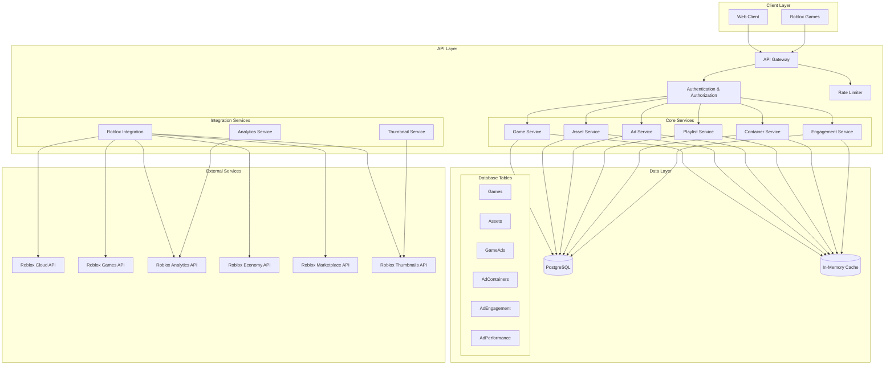

# System Architecture

## Overview
This document provides a visual representation of the Roblox Asset Management System architecture, showing how different components interact with each other.

## Architecture Diagram

## Component Description

### Client Layer
- **Web Client**: Browser-based interface for game owners and administrators
- **Roblox Games**: Games integrated with the system via API

### API Layer
- **API Gateway**: Central entry point for all requests
- **Authentication & Authorization**: Handles API key validation and access control
- **Rate Limiter**: Enforces request limits per client

### Core Services
- **Game Service**: Manages game-related operations
- **Asset Service**: Handles asset management
- **Ad Service**: Controls advertisement operations
- **Playlist Service**: Manages asset playlists
- **Container Service**: Manages ad containers with types and status
- **Engagement Service**: Tracks and analyzes user interactions

### Integration Services
- **Roblox Integration**: Coordinates with various Roblox APIs
- **Thumbnail Service**: Manages asset thumbnails
- **Analytics Service**: Handles performance tracking

### Data Layer
- **PostgreSQL**: Primary data store
  - Games: Game metadata and relationships
  - Assets: Asset data and metadata
  - GameAds: Ad campaign information
  - AdContainers: Container configurations and status
  - AdEngagement: Real-time interaction tracking
  - AdPerformance: Aggregated metrics and analytics
- **In-Memory Cache**: Performance optimization layer

### External Services
Various Roblox APIs that the system integrates with for different functionalities.

## Data Flow

### Container Management Flow
1. Game owner creates container in web interface
2. Container Service validates and stores configuration
3. Roblox game requests container content
4. Ad Service delivers appropriate content
5. Engagement Service tracks interactions
6. Analytics Service aggregates performance data

### Container Types
- **DISPLAY**: Billboard-style advertisements
- **NPC**: Interactive character advertisements
- **MINIGAME**: Interactive game-based advertisements

### Container States
- **ACTIVE**: Container is operational and serving ads
- **INACTIVE**: Container is temporarily disabled
- **MAINTENANCE**: Container is under maintenance

### Engagement Tracking
- Real-time interaction monitoring
- Automatic performance metrics collection
- Analytics aggregation and reporting
- User behavior analysis 